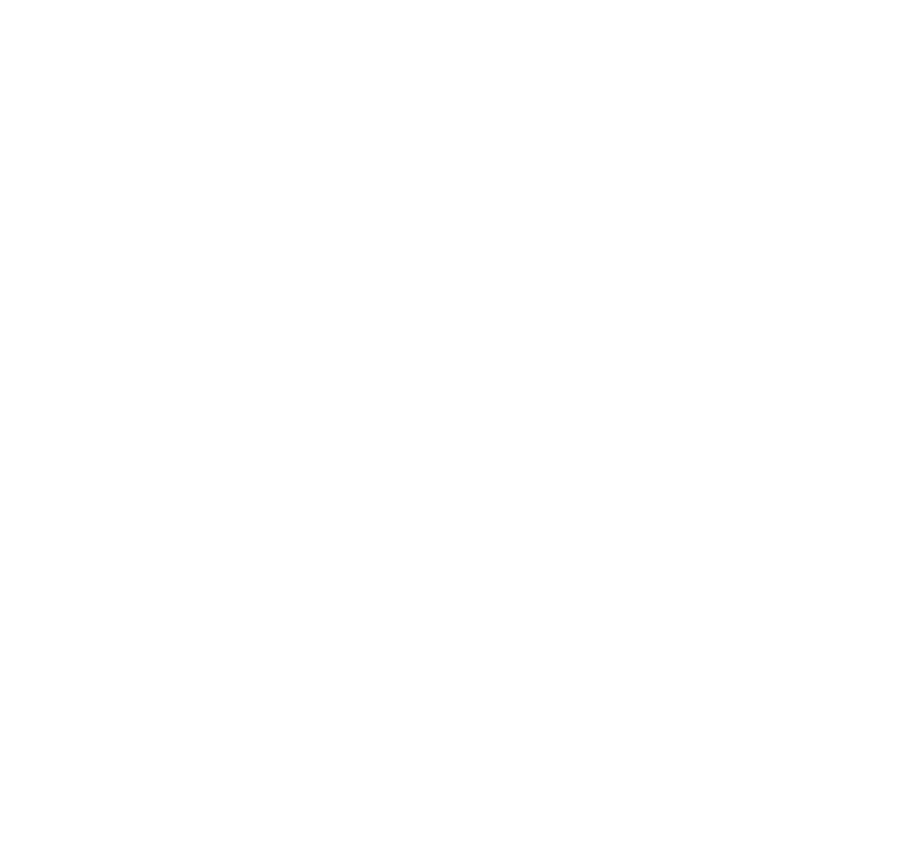
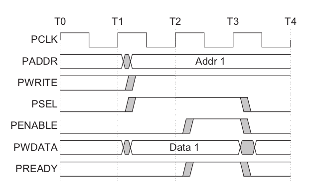
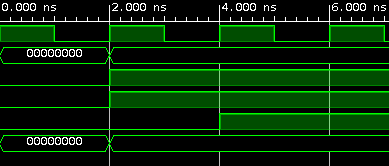

# Advanced Peripherial Bus (APB) Notes 

## Introduction

The Advanced Peripheral Bus (APB) is part of the Advanced Microcontroller Bus Architecture (AMBA) protocol family.

It is a low-cost interface and it is optimized for minimal power consumption and reduced interface complexity. It is **Non-Pipelined** protocol, used to connect low-bandwidth peripherals that don't require the high performance of AXI protocol.

**Mostly, used to connect the external peripheral to the SoC.** In APB, every transfer takes at least two clock cycles (Setup Cycle and Access Cycle) to complete. It can also interface wirh AHB and AXI protocols using the bridges in between.

---

## Standart APB Signals 

### APB Bridge Signals 

`pClk`

* Peripheral Clock Signal.

`pResetN`

* Peripheral Active Low Reset Signal.

`pAddr`

* APB Address Bus. It can be **up to 32 bits wide.**

`pProt`

* Protection type. This signal indicates the normal, privileged, or secure protection level of the transaction and whether the transaction is a data access or an instruction access.

`pSel`

* The APB bridge unit generates this signal to each peripheral bus slave.
It indicates that the slave device is selected and that a data transfer is required.

* There is a PSELx signal for each slave. 

`pEnable`

* Enable. This signal indicates the second and subsequent cycles of an APB
transfer.

`pWrite`

* Direction. This signal indicates an APB write access when HIGH and an APB
read access when LOW.

`pWData`

* Write data. This bus is driven by the peripheral bus bridge unit during write cycles when PWRITE is HIGH. This bus can be **up to 32 bits wide.**

`pStrb`

* Write strobes. This signal indicates which byte lanes to update during a write transfer. There is one write strobe for each eight bits of the write data bus.

### APB Slave Device Signals

`pReady`

* The Slave uses this signal to extend an APB transfer. This can be better understood in the State Mechine diagram.


`pRData`

* Read Data. The selected slave drives this bus during read cycles when
PWRITE is LOW. This bus can be up to 32-bits wide


`pSlverr`

* This signal indicates a transfer failure.

* APB peripherals are not required to support the PSLVERR pin.

> Where a peripheral does not include this pin then the appropriate input to the APB bridge is tied LOW.

---

## APB Slave Device Inputs/Outputs

<br>




---

## Testbench For APB Bridge (Master)


<p float="left">
  
   
</p>

<br>


# PWM Peripheral

Pulse-width modulation (PWM), is a **modulation technique used to encode
a message into a pulsing signal**. Although this modulation technique can be
used to encode information for transmission, its main use is to allow the
control of the power supplied to electrical devices, especially to inertial
loads such as motors, and is a typical application for embedded electronic
devices such as low-power microcontrollers.

The PWM controller has to be programmed from an APB interface, and it
features the following pinout : 

```
module APB_PWM
(
    //APB Interface
    input           pClk,
    input           pResetN,
    input  [31:0]   pAddr,
    input           pSel,
    input           pEnable,
    input           pWrite,
    input  [31:0]   pWData,

    output          pReady,
    output [31:0]   pRData,

    output          Waveform
);
```

| Register   | Address | Width   | Type       |
| --------   | ------- | -----   | ----       |
| PWM Period | 0x0     |  32-Bit | read/write |
| PWM Pulse  | 0x4     |  32-Bit | read/write |
| PWM Enable | 0x8     |  1-Bit  | read/write |
